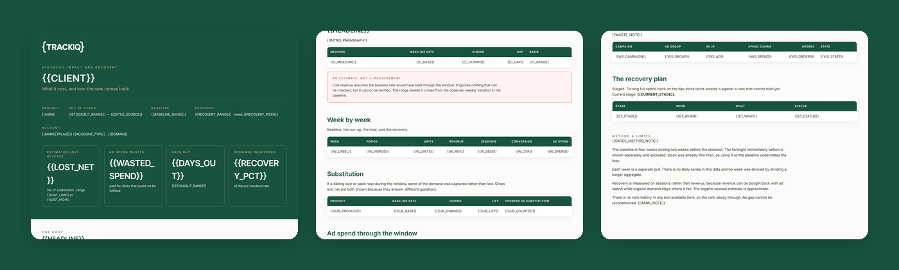

# TrackIQ: Amazon Stockout Impact and Recovery

The skill you run **after** the thing you were trying to prevent.

**What did that stockout cost, and how do we get the rank back?**

Part of **Amazon Inventory** in the
[TrackIQ skills catalog](https://github.com/TrackIQ-HQ/amazon-seller-skills).

Built as an [Agent Skill](https://code.claude.com/docs/en/skills). Runs in
Claude Code, Claude web, Claude desktop and ChatGPT from the same folder.

---

## ⚠ This skill needs a scraper connection

Part of what this reads only exists on the public product page, so it needs an
**Oxylabs scraper** connection alongside the TrackIQ MCP. Scraper calls cost
credits per ASIN or keyword per run, and the skill states the run's cost in its
output.

There is no first-party substitute for the scraped fields — the skill says so
rather than approximating them.

---

## Powered by the TrackIQ MCP

[](https://trackiq.com/mcp)

This skill reads your live Amazon account through the
**[TrackIQ MCP](https://trackiq.com/mcp)** — 16 tools connecting your AI
assistant to Amazon data:

Sales & Traffic · Orders · Inventory · Returns · Sponsored Products · Sponsored
Brands · Sponsored Display · Amazon DSP · AMC Cloud · Keywords · Search Terms ·
Targeting · Search Query Performance · Organic Rank · Best Seller Rank · Buy Box
History · Brand Analytics · Export

Works with Claude, ChatGPT and Cursor. **[Get access →](https://trackiq.com/mcp)**

---

## What you get



Measures what a completed Amazon stockout actually cost — lost units and revenue against the pre-stockout run rate, how far sessions and conversion fell, whether they have come back, and how long recovery is taking — then produces a staged plan for restarting ads and rebuilding rank. Use when the user asks what a stockout cost, lost sales from being out of stock, stockout impact, recovery after a stockout, how long to recover rank, or why sales have not bounced back after restocking.

### The rules that keep it honest

- **There is no daily series per ASIN**
- **The inventory snapshot has no history**
- **The baseline excludes the run-up**
- **Lost revenue is a counterfactual, not a measurement**

The full list is in `SKILL.md`, and each one exists because getting it wrong
produces a confident, wrong answer rather than an obvious error.

## Requirements

- The TrackIQ MCP, for `list_marketplaces`, `get_product_performance`, `get_inventory_snapshot` and `get_product_ads`. - **The stockout window** — when the ASIN went to zero and when it came back. Ask; the inventory snapshot only shows today. See non-negotiable 2. - **The Oxylabs scraper**, if rank recovery is wanted. The MCP has no rank history. - Nothing else. No filesystem, no shell, no internet. - **Without the MCP:** works from weekly Business Report exports covering the weeks before, during and after.

---

## Install

### Claude Code

```
/plugin marketplace add TrackIQ-HQ/amazon-seller-skills
/plugin install trackiq-amazon-stockout-impact@trackiq
```

### Claude web, desktop, mobile

1. Download the `.zip` from the
   [latest release](https://github.com/TrackIQ-HQ/trackiq-amazon-stockout-impact/releases)
2. **Settings → Capabilities → Skills** (code execution must be on)
3. **Create skill → Upload a skill**, choose the `.zip`
4. Toggle it on

### ChatGPT

Same zip. **Plugins → Skills → Create → Upload from your computer.**

---

## Setup

Answers live in `account.md`, copied from
[`assets/account.example.md`](skills/trackiq-amazon-stockout-impact/assets/account.example.md).
**Every TrackIQ skill reads the same file**, so an account already set up for
another TrackIQ report needs nothing added.

## Delivery

Asked once and stored in `account.md`: **in-chat** (default), **file**,
**Slack**, **n8n** or **email**. Anything leaving the chat confirms with you
first and falls back to in-chat, with a note.

---

## Customizing

| File | What it controls |
|---|---|
| `checks.md` | the pre-send checks |
| `method.md` | the method and every threshold |
| `pulls.md` | the call sequence and its traps |
| `report-template.html` | the report shell |

---

## Contributing

```bash
python scripts/validate.py    # must exit 0 before any commit
python scripts/build.py       # writes dist/ zip + registry.json
```

Read [AUTHORING.md](https://github.com/TrackIQ-HQ/amazon-seller-skills/blob/main/AUTHORING.md)
before proposing changes.

## License

MIT. See [LICENSE](LICENSE).
